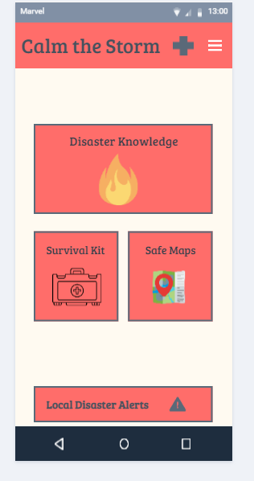
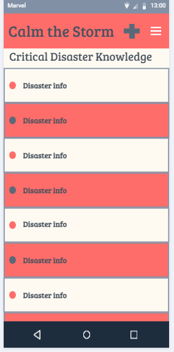
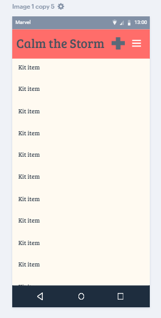
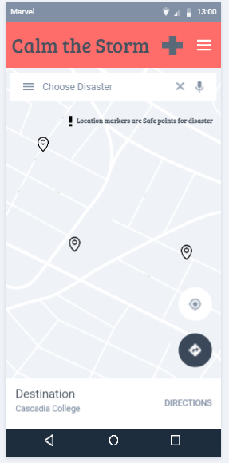
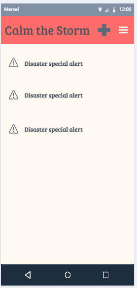

# App Name “Calm the Storm”

Have you ever been afraid of natural disasters? Unsure of how to prepare or what to do if one occurs? With Calm the Storm, you can find everything you need to survive and prepare for any natural disaster. From general disaster knowledge to creating a survival kit, Calm the Storm will have you feeling prepared and knowledgeable for any disaster situation.

# Customers

## Personas

- Professional photographer/hobby: Sarah, professsional adult interested in photography.  
- Professional working adult: John visiting Tokyo, Japan during vacation.
- College student: Billy is creating plans for his summer vacation to visit Indonesia which is known for its volcanoes.   

## Pain points and user needs
 
- When Sarah is working at a secluded area, be able to get information and solutions in case a natural disaster happens even with no services.    
- Sarah needs information about natural disasters just in case mother nature reacts.   
- John is sight-seeing Tokyo and realized he was going through an earthquake.
- Billy wants to gain information about volcanoes in Indonesia so he can be aware.  

## Scenarios

- Sarah needs to locate areas on her job site to take photographs for her upcoming project.  With no service, the offline feature guide helped her reach her destinations to finish her tasks.
- Sarah wants information about hurricanes due to the weather condition.  She is able to gain insight for her next decisions to put her in a safe location.
- John's first time in a earthquake put him in a confused state.  After gaining insight on earthquake checklists he was able to find a secure shelter and bring useful materials to assist his environment through the offline checklist feature on the app.  
- Billy was able to gain insight for his Indonesia trip and feels confident to react during a volcanoe eruption.  The information was offered in the  natural disaster page of the app.

# Competitive analysis

## Strengths
- Integrated survival tips
- National Agency name recognitions
- Integration with national alerts, and location services
- Offline use for survival tips.

## Weaknesses
- Notification usefulness
- Don’t offer location specific disaster information.
- Generic survival information

## Opportunities
- Location specific emergency information.
- Detailed survival instructions, first aid, how-to, etc.
- More “personalized”

## Threats
- Opposition has budget.
- Brand recognition for national emergencies
- Opposition is integrated with national alerts, location services, mapping, etc.

## Competing Apps: 
### Android: 

**_Disaster Management_**   
Who:  People in Mumbai over 10k downloads.   
What: Allows users to track different disaster-contributing factors such as traffic, and weather/rainfall.  
When:  Use it when disaster is likely/possible.  
Where: Is available on the Google Play store.  
Why: This app would be good for people in Mumbai who wanted to be aware of impending disaster.  
How: 187 reviews, 4 stars. (seems to be not being maintained currently).  Users like the rainfall tracking information the most.

### Apple (mobile app): 
**_FEMA_**   
Who: For people who want emergency alerts, or to locate local shelters.  
What:  Allows you to subscribe to FEMA alerts, and use location services to find open emergency shelters. Gives advice on how to survive, building a kit.  
When: Used during emergency situations.  
Where: App is on apple App Store.  
Why:  This app is a good generic emergency app, it has lots of information on many types of disasters.  Offline use still has “safety tips” section.  
How:  Only 3 stars. Users are using it to get weather alerts mostly.  App seems to have issues with notifications – both with notifications not arriving, and notifications pinging too often.

# Implementation

## User stories

Prioritized list of functional components that describe the implementation from an end-user perspective.

- _P0:_ As a user, I need access to survival information when there is no service.
- _P0:_ As a user, I need to be able to read instructions for what to do in a disaster.
- _P1:_ As a user, I would like to be able to see a map of safe locations during disasters.
- _P1:_ As a user, I would like help building a survival kit to help during a disaster.
- _P2:_ As a user, I would like to have my disaster app display emergency alerts so I don't have to go to another source.

## Walk through

- [Calm the Storm](https://marvelapp.com/prototype/feajj6h/screen/75156008 "Calm the Storm prototype")

## Screens

## Color

- Primary color: FF6D6A
- Secondary color: FFFAF1
- Primary text color: 47525E
- Secondary text color: FF6D6A

## App icon

Our icon will also not be black but be our primary text color of 47525E

## Integration

For integration we will be using integration with Google maps for our safe maps feature and with FEMA to update our disaster information with the most up to date and relevant info.

# Future considerations   

## Usability summary

After the last round of testing, we decided to clean up the app some. We organized the sections of the app into tiles so that each section is easily accessed with a click of the button. We simplified the content into basic design so that our users can just see how content is displayed. What was needed to be changed is how interactive our MyKit section is. It needs to be changed so that users can "check" off the items they have collected for their kits.

## Monetization

With the design of our app and intended use, we feel that ads are not the way to go and this app will be either paid or as a non-profit with support from other organization. The app is intended to reach as many people as possible and being as accessible as possible.

## Measuring engagement

The engagement of our users would typically be a user that access our app 2-5 times a month. With our app being focused on natural disasters, people aren't going to be on it at all times. They might check in at our alerts from time to time, or add something to their survival kit. But most people won't be accessing it until there is an imminent threat of disaster which can happen at anytime.

## Stretch features

Some future considerations we may have is some kind of emergency response integration that will notify emergency services that you are in distress. A feature that allows our My kit items to be checked off as well.
